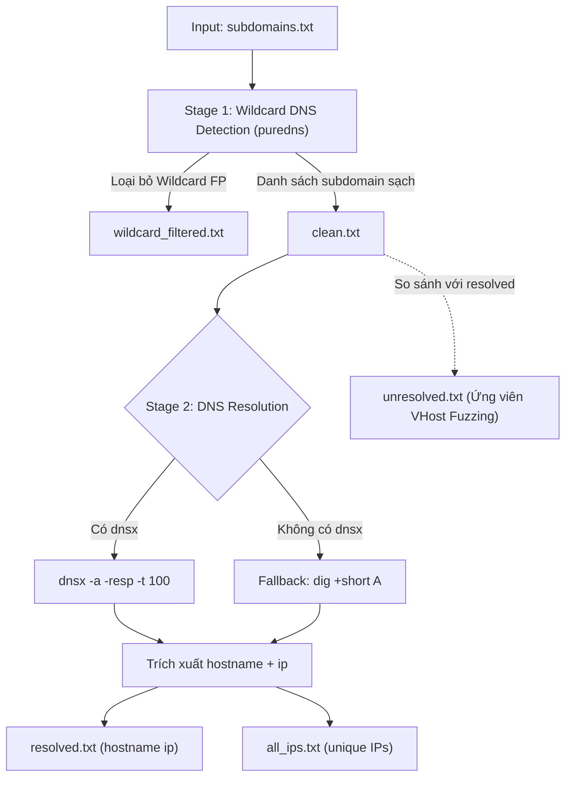

# 02_resolve.sh — DNS Resolution & Wildcard Filter

> Tài liệu kỹ thuật mô tả cách sử dụng, input, cơ chế hoạt động và output của script `scripts/02_resolve.sh`.

---

## 1. Cách sử dụng

### 1.1. Chạy trong toàn bộ Recon Pipeline (Khuyến nghị)
```bash
# Chạy từ bước 02 trở đi
./recon.sh example.com --from 02

# Chỉ chạy duy nhất bước 02 (yêu cầu đã có kết quả từ bước 01 subdomain)
./recon.sh example.com --only 02
```

### 1.2. Chạy độc lập script
```bash
# Cú pháp cơ bản
./pipeline/scripts/02_resolve.sh example.com
```

### 1.3. Yêu cầu hệ thống / Công cụ cần thiết
* **`puredns`** (Khuyến nghị): Công cụ lọc Wildcard DNS chuyên sâu (`go install github.com/d3mondev/puredns/v2@latest`).
* **`dnsx`** (Khuyến nghị): Công cụ DNS resolver đa luồng tốc độ cao từ ProjectDiscovery (`go install -v github.com/projectdiscovery/dnsx/cmd/dnsx@latest`).
* **`dig` / `bind-utils`**: Fallback dự phòng nếu máy chưa cài `dnsx`.
* **`curl`**: Dùng để tự động tải danh sách public DNS resolvers tin cậy nếu máy chưa có sẵn.

---

## 2. Input của Script

Script nhận dữ liệu từ bước `01_subdomain.sh` trong thư mục `output/<domain>/` (hoặc `recon_output/<domain>/`):

| File Input | Nguồn (Bước) | Bắt buộc | Mục đích sử dụng |
| :--- | :--- | :---: | :--- |
| `subdomains.txt` | `01_subdomain.sh` | **BẮT BUỘC** | Toàn bộ danh sách subdomains thu thập được từ bước enum trước đó. |
| `resolvers.txt` | `/usr/share/wordlists/` hoặc tải tự động | Không | Danh sách các Public DNS Resolver chất lượng cao để puredns kiểm tra wildcard. |

> [!IMPORTANT]
> Nếu file `subdomains.txt` không tồn tại hoặc rỗng, script sẽ dừng lại với thông báo lỗi yêu cầu chạy bước `01_subdomain.sh` trước.

---

## 3. Cơ chế hoạt động (Detailed Mechanism)

Quá trình phân giải DNS và lọc dữ liệu của `02_resolve.sh` được thực thi qua 2 giai đoạn nối tiếp:



### Stage 1: Phát hiện và lọc Wildcard DNS (`puredns`)
* **Vấn đề thực tế**: Một số tổ chức cấu hình DNS wildcard (ví dụ: `*.example.com` $\rightarrow$ IP của CDN/WAF hoặc Landing page mặc định). Khi đó, hàng ngàn subdomain rác hoặc ngẫu nhiên đều trả về IP, gây ra hàng loạt False Positive (ảo giác subdomain) và làm nghẽn bước VHost Fuzzing sau này.
* **Cơ chế xử lý**:
  1. Script tìm file resolvers tại `/usr/share/wordlists/resolvers.txt`. Nếu chưa có, script tự động tải danh sách public resolvers chuẩn từ Trickest GitHub.
  2. Thực thi `puredns resolve` trên danh sách subdomains đầu vào. `puredns` tự động kiểm tra xem domain có cấu hình wildcard hay không bằng cách gửi các truy vấn DNS giả lập ngẫu nhiên.
  3. Lọc bỏ toàn bộ các subdomain thuộc wildcard và xuất danh sách các subdomain này vào `wildcard_filtered.txt`.
  4. Giữ lại danh sách các subdomain thực sự hợp lệ (`clean.txt`) để chuyển sang Stage 2.

### Stage 2: Phân giải địa chỉ IP (`dnsx` / `dig`)
* **Sử dụng `dnsx` (Ưu tiên)**:
  * Thực thi:
    ```bash
    dnsx -l "$CLEAN_LIST" -a -resp -no-color -silent -timeout 10s -retry 3 -t 100
    ```
  * Truy vấn A record với 100 luồng đồng thời, tự động retry 3 lần nếu mạng chập chờn.
  * Phân tích kết quả dạng `hostname [A] [ip]` để ghi vào `resolved.txt` (`<hostname> <ip>`) và `all_ips.txt` (`<ip>`).
* **Fallback `dig`**:
  * Nếu chưa cài `dnsx`, script tự động chuyển sang vòng lặp `dig +short A <host>` để phân giải lần lượt từng tên miền.

### Stage 3: Xác định Unresolved Subdomains (VHost Candidates)
* Sử dụng lệnh `comm -23` so sánh giữa danh sách subdomain sạch (`clean.txt`) và danh sách đã phân giải được (`resolved.txt`).
* Các subdomain không có bản ghi A công cộng sẽ được lưu vào file `unresolved.txt`.
* **Ý nghĩa Pentest**: Các domain trong `unresolved.txt` là ứng viên hàng đầu cho bước `04_vhost.sh` để kiểm tra Virtual Host nội bộ (VHost Fuzzing) trên các IP Origin.

---

## 4. Output của Script

Tất cả kết quả được lưu trực tiếp tại thư mục target `output/<domain>/` (hoặc `recon_output/<domain>/`):

| File Output | Định dạng | Mô tả nội dung |
| :--- | :--- | :--- |
| `resolved.txt` | `<hostname> <ip>` | Danh sách các subdomain đã phân giải thành công kèm địa chỉ IP tương ứng. |
| `all_ips.txt` | `<ip>` | Danh sách tất cả các địa chỉ IPv4 duy nhất (loại bỏ trùng lặp) tìm được. |
| `unresolved.txt` | `<hostname>` | Danh sách các subdomain không thể phân giải ra IP công cộng (input cho `04_vhost.sh`). |
| `wildcard_filtered.txt` | `<hostname>` | Danh sách các subdomain bị loại bỏ do dính wildcard DNS. |

---

## 5. Mẫu kết quả đầu ra

### Mẫu `resolved.txt`
```text
api.mbbank.com.vn 103.12.104.29
online.mbbank.com.vn 103.12.104.78
portal.mbbank.com.vn 103.12.104.29
```

### Mẫu `all_ips.txt`
```text
103.12.104.29
103.12.104.78
125.212.138.88
```

### Mẫu `unresolved.txt`
```text
admin-internal.mbbank.com.vn
dev-api.mbbank.com.vn
staging-portal.mbbank.com.vn
```
