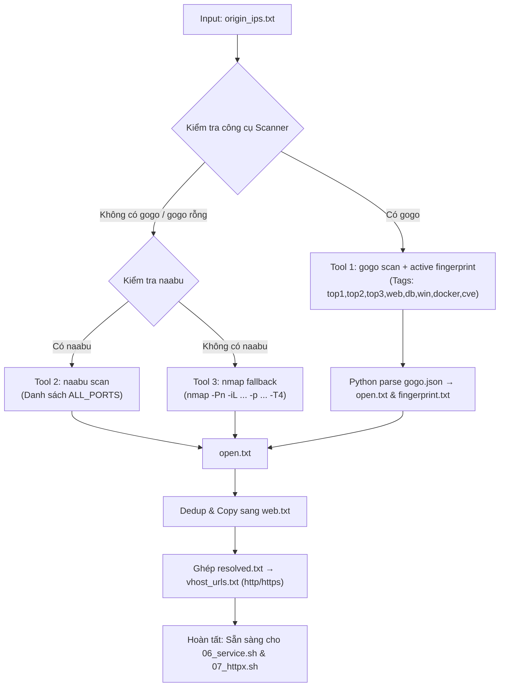

# 05_portscan.sh — Port Scanning & Active Fingerprinting

> Tài liệu kỹ thuật mô tả cách sử dụng, input, cơ chế hoạt động và output của script `scripts/05_portscan.sh`.

---

## 1. Cách sử dụng

### 1.1. Chạy trong toàn bộ Recon Pipeline (Khuyến nghị)
```bash
# Chạy từ bước 05 trở đi
./recon.sh example.com --from 05

# Chỉ chạy duy nhất bước 05 (yêu cầu đã có kết quả từ bước 03 cdncheck)
./recon.sh example.com --only 05
```

### 1.2. Chạy độc lập script
```bash
# Cú pháp cơ bản
./pipeline/scripts/05_portscan.sh example.com
```

### 1.3. Yêu cầu hệ thống / Công cụ cần thiết
* **Công cụ quét chính (Ưu tiên theo thứ tự)**:
  1. **`gogo`** (Khuyến nghị - chainreactors/gogo): Tích hợp quét port, active fingerprint, và check lỗ hổng CVE tự động.
  2. **`naabu`** (ProjectDiscovery): Quét cổng tốc độ cao nếu không có `gogo`.
  3. **`nmap`**: Fallback dự phòng cuối cùng (`apt install nmap`).
* **`python3`**: Dùng để phân tích kết quả JSON từ `gogo`.
* **Quyền ulimit**: Script tự động thực thi `ulimit -n 65535` để tối ưu kết nối mạng khi quét đa luồng.

---

## 2. Input của Script

Script nhận dữ liệu từ các bước trước trong thư mục `output/<domain>/` (hoặc `recon_output/<domain>/`):

| File Input | Nguồn (Bước) | Bắt buộc | Mục đích sử dụng |
| :--- | :--- | :---: | :--- |
| `origin_ips.txt` | `03_cdncheck.sh` | **BẮT BUỘC** | Danh sách các Origin IP đã được lọc sạch CDN/WAF để thực hiện quét cổng. |
| `resolved.txt` | `02_resolve.sh` | Không | Bản đồ `subdomain <-> IP` để ghép tạo danh sách URL vhost tương ứng với port mở. |

> [!IMPORTANT]
> Nếu file `origin_ips.txt` không tồn tại hoặc rỗng, script sẽ dừng lại và yêu cầu chạy bước `03_cdncheck.sh` trước để phân loại IP.

---

## 3. Cơ chế hoạt động (Detailed Mechanism)

Quy trình hoạt động của `05_portscan.sh` bao gồm các giai đoạn sau:



### Giai đoạn 1: Tối ưu Socket & Chọn Scanner (Scanner Fallback Hierarchy)
1. **Thiết lập ulimit**: Thực thi `ulimit -n 65535` để tránh nghẽn file descriptor khi mở nhiều luồng quét song song.
2. **Thứ tự ưu tiên công cụ**:
   * **Ưu tiên 1 (`gogo`)**:
     * Sử dụng tập port tags toàn diện: `top1,top2,top3,web,db,win,docker,cve`.
     * Quét và xuất file nhị phân `.dat`, sau đó tự động convert sang `gogo_raw.json`.
     * Tự động lấy fingerprint, SSL certificate Subject/SAN, HTTP title, Web framework và kiểm tra lỗ hổng CVE tích hợp.
   * **Ưu tiên 2 (`naabu`)**:
     * Kích hoạt khi không có `gogo` hoặc `gogo` không ra kết quả.
     * Quét với `rate 1000` và `timeout 5s` trên danh sách `ALL_PORTS`.
   * **Ưu tiên 3 (`nmap`)**:
     * Fallback cuối cùng nếu cả `gogo` và `naabu` đều không có trên máy:
       ```bash
       nmap -Pn -iL "$IN_IPS" -p "$ALL_PORTS" -T4 --open -n -oG -
       ```

### Giai đoạn 2: Phân tích JSON & Trích xuất Fingerprint (Với `gogo`)
* Script Python nội tuyến parse file `gogo_raw.json`:
  * Trích xuất các cổng mở ghi vào `ports/open.txt` theo định dạng `ip:port`.
  * Trích xuất thông tin chi tiết vào `ports/fingerprint.txt`:
    * Giao thức (`protocol`), HTTP status code (`[200]`, `[403]`,...).
    * Tên máy chủ / Chứng chỉ SSL (`host:xxx`).
    * Tiêu đề trang (`title:xxx`) và Banner server (`banner:xxx`).
    * Công nghệ / Framework phát hiện (`fw:xxx`).
    * Lỗ hổng CVE nếu có (`VULN:xxx`).

### Giai đoạn 3: Chuẩn hóa, Lưu IP không mở cổng & Sinh URL cho HTTP Probing
* **Lưu IP không mở cổng (`ports/closed_ips.txt`)**: Script sử dụng `comm -23` so sánh danh sách `origin_ips.txt` với danh sách các IP có cổng mở để lưu toàn bộ các IP đóng / bị firewall filter vào `ports/closed_ips.txt`.
* **Không lọc cứng Web Ports**: Toàn bộ các cổng mở trong `open.txt` được sao chép sang `web.txt` để đảm bảo không bỏ sót bất kỳ cổng dịch vụ nào.
* **Xây dựng `vhost_urls.txt` (Vhost-aware URL mapping)**:
  * Đọc từng `ip:port` mở:
    1. Tra cứu ngược trong `resolved.txt` để tìm tất cả các subdomain trỏ về IP đó.
    2. Gán giao thức thích hợp:
       * Cổng `443, 8443, 4443, 9443` $\rightarrow$ `https://subdomain:port`.
       * Cổng `80` $\rightarrow$ `http://subdomain:port`.
       * Các cổng web thông dụng khác $\rightarrow$ `http://subdomain:port`.
       * **Tất cả các cổng non-standard / dịch vụ khác** $\rightarrow$ Sinh **cả 2 URL** `http://` và `https://` để `httpx` tự dò tìm giao thức chính xác.
    3. Sinh thêm URL trực tiếp theo IP (`http(s)://ip:port`) để probe trực tiếp qua IP.

---

## 4. Output của Script

Tất cả kết quả được lưu tại thư mục `output/<domain>/ports/` (hoặc `recon_output/<domain>/ports/`):

| File Output | Định dạng | Mô tả nội dung |
| :--- | :--- | :--- |
| `open.txt` | `ip:port` | Danh sách tất cả các cổng mở được phát hiện trên toàn bộ Origin IPs (đã loại bỏ trùng lặp). |
| `closed_ips.txt` | `ip` | Danh sách các IP không mở cổng nào (bị đóng hoặc firewall drop/filter). |
| `web.txt` | `ip:port` | Danh sách port mở chuyển tiếp cho các bước HTTP probing tiếp theo. |
| `vhost_urls.txt` | URL list | Danh sách URL hoàn chỉnh (`http(s)://sub:port` & `http(s)://ip:port`) làm input chuẩn cho `07_httpx.sh`. |
| `gogo.json` | JSON format | Toàn bộ dữ liệu thô từ công cụ `gogo` (kèm thông số cấu hình và metadata). |
| `fingerprint.txt` | Plain Text | Bảng tổng hợp dịch vụ, status code, SSL host, framework và cảnh báo VULN/CVE từ `gogo`. |

---

## 5. Mẫu kết quả đầu ra

### Mẫu `ports/open.txt`
```text
103.12.104.29:443
103.12.104.29:8443
103.12.104.33:80
125.212.138.88:8888
```

### Mẫu `ports/fingerprint.txt`
```text
103.12.104.29:443  https  [200]  host:mbbank.com.vn  title:MBBank - Ngân hàng Quân Đội  fw:nginx,vue
103.12.104.29:8443  https  [200]  title:Apache Tomcat  fw:tomcat
125.212.138.88:8888  http  [200]  title:Go Web Server  banner:Golang
```

### Mẫu `ports/vhost_urls.txt`
```text
https://api.mbbank.com.vn:443
https://online.mbbank.com.vn:8443
http://internal-portal.mbbank.com.vn:8888
https://internal-portal.mbbank.com.vn:8888
https://103.12.104.29:443
```
