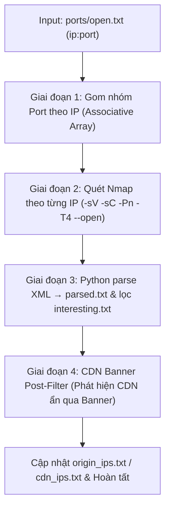

# 06_service.sh — Service Detection & Banner Inspection

> Tài liệu kỹ thuật mô tả cách sử dụng, input, cơ chế hoạt động và output của script `scripts/06_service.sh`.

---

## 1. Cách sử dụng

### 1.1. Chạy trong toàn bộ Recon Pipeline (Khuyến nghị)
```bash
# Chạy từ bước 06 trở đi
./recon.sh example.com --from 06

# Chỉ chạy duy nhất bước 06 (yêu cầu đã có kết quả từ bước 05)
./recon.sh example.com --only 06
```

### 1.2. Chạy độc lập script
```bash
# Cú pháp cơ bản
./pipeline/scripts/06_service.sh example.com
```

### 1.3. Yêu cầu hệ thống / Công cụ cần thiết
* **`nmap`**: Công cụ quét dịch vụ và chạy NSE scripts (`apt install nmap` hoặc `brew install nmap`).
* **`python3`**: Sử dụng thư viện chuẩn `xml.etree.ElementTree` để phân tích file XML từ Nmap (không cần cài thêm thư viện ngoài).
* **`bash` (v4+)**: Sử dụng Associative Arrays (`declare -A`) để gom nhóm port theo từng IP.

---

## 2. Input của Script

Script nhận dữ liệu từ các bước trước trong thư mục `output/<domain>/` (hoặc `recon_output/<domain>/`):

| File Input | Nguồn (Bước) | Bắt buộc | Mục đích sử dụng |
| :--- | :--- | :---: | :--- |
| `ports/open.txt` | `05_portscan.sh` | **BẮT BUỘC** | Danh sách các cổng đang mở dạng `ip:port` cần quét dịch vụ. |
| `origin_ips.txt` | `03_cdncheck.sh` | Không | Danh sách Origin IPs hiện tại (dùng để hậu kiểm và loại trừ IP CDN ẩn). |
| `cdn_ips.txt` | `03_cdncheck.sh` | Không | Danh sách IP CDN (dùng để bổ sung thêm nếu phát hiện CDN qua banner). |

> [!IMPORTANT]
> Nếu file `ports/open.txt` không tồn tại hoặc rỗng, script sẽ dừng lại với thông báo lỗi yêu cầu chạy bước `05_portscan.sh` trước.

---

## 3. Cơ chế hoạt động (Detailed Mechanism)

Luồng xử lý của `06_service.sh` được chia làm 4 giai đoạn chính:



### Giai đoạn 1: Gom nhóm Port theo IP (Port Grouping)
* Script đọc từng dòng `ip:port` trong `ports/open.txt`.
* Sử dụng mảng kết hợp trong Bash (`declare -A IP_PORTS`) để gộp tất cả các port mở của cùng một IP lại thành chuỗi phân cách bởi dấu phẩy (ví dụ: `103.12.104.29` $\rightarrow$ `443,8443`).
* **Mục đích**: Tối ưu hóa hiệu năng, Nmap chỉ cần khởi tạo kết nối **1 lần cho mỗi IP** với tham số `-p port1,port2,...` thay vì phải chạy nmap riêng lẻ cho từng port.

### Giai đoạn 2: Quét chi tiết dịch vụ với Nmap (Service Scanning & NSE)
* Với mỗi IP, script thực thi lệnh Nmap:
  ```bash
  nmap -sV -sC -Pn -T4 --open -p "$ports" -oX "$IP_XML" -oN "$IP_TXT" "$ip"
  ```
* **Giải thích các tham số**:
  * `-sV`: Probe Service Version detection (xác định chính xác tên dịch vụ, phiên bản, thông tin bổ sung).
  * `-sC`: Kích hoạt bộ script mặc định (Default NSE scripts) để thu thập banner, SSL certificate info, HTTP title, SMB OS discovery,...
  * `-Pn`: Bỏ qua bước ping / host discovery, xử lý trực tiếp các port mở (tránh bị firewall drop ICMP dẫn đến hiểu lầm host bị offline).
  * `-T4`: Timing template tối ưu tốc độ quét nhanh và ổn định.
  * `--open`: Chỉ trả về và hiển thị các cổng thực sự mở.
  * `-oX`: Xuất kết quả chi tiết dạng XML vào thư mục tạm (`$TEMP_DIR`) để phân tích tự động.
  * `-oN`: Lưu kết quả dạng text trực quan vào `services/raw.txt`.

### Giai đoạn 3: Phân tích XML & Triage tự động bằng Python
* Script gọi Python script nội tuyến dùng `xml.etree.ElementTree` để parse file XML của từng IP:
  1. **Trích xuất thông tin dịch vụ**: Lấy `ip`, `portid`, `protocol`, `service_name`, `product`, `version`, `extrainfo`. Định dạng thành chuẩn:
     ```text
     <ip>:<port>/<protocol>   <service_name>   <product> <version> <extrainfo>
     ```
  2. **Tự động gắn cờ dịch vụ nhạy cảm (`services/interesting.txt`)**:
     * **Danh sách dịch vụ đáng chú ý (`INTERESTING_SVCS`)**:
       * Database: `mssql`, `mysql`, `postgresql`, `oracle`, `mongodb`, `redis`, `elasticsearch`.
       * Quản trị / Remote access: `ssh`, `telnet`, `rdp`, `vnc`, `msrpc`, `smb`, `ldap`, `netbios`.
       * Middleware / DevOps / Messaging: `jenkins`, `jmx`, `ajp13`, `kibana`, `kafka`, `zookeeper`.
       * Mail / Giao thức mạng: `ftp`, `smtp`, `imap`, `pop3`, `http`, `https`.
     * **Phiên bản & Dấu hiệu rủi ro (`INTERESTING_VERSIONS`)**:
       * Server/Middleware: `apache`, `nginx`, `iis`, `tomcat`, `jetty`, `jboss`, `websphere`, `weblogic`, `struts`, `spring`, `openssl`.
       * Phiên bản cũ / lỗi thời: `2.4`, `1.1`, `7.`, `8.`, `9.`.
       * Từ khóa lỗ hổng: `CVE`, `cve`, `vulnerable`.
  3. **Trích xuất phát hiện từ NSE Script**:
     * Đọc các thông tin bổ sung từ NSE scripts (ví dụ `ssl-cert`, `http-title`, `vulners`...).
     * Nếu output script chứa từ khóa `VULNERABLE` hoặc `CVE`, tự động ghi nhận cảnh báo đặc biệt vào `services/interesting.txt`.

### Giai đoạn 4: Hậu kiểm & Lọc CDN qua Banner (CDN Banner Post-filter)
* **Vấn đề thực tế**: Một số CDN/WAF lớn (như Akamai, Cloudflare, Fastly...) đặt Edge node/PoP server tại các ISP nội địa (VNPT, Viettel, FPT) nên có ASN địa phương. Do đó, công cụ phân loại IP dựa vào ASN/CIDR ở bước `03_cdncheck.sh` có thể bị sót và coi các IP này là Origin server.
* **Cơ chế xử lý**:
  * Script quét tìm các từ khóa CDN trong `services/parsed.txt`:
    `akamai | akamaiGHost | cloudflare | fastly | incapsula | sucuri | imperva | edgecast | verizon | limelight | cdnetworks`
  * Nếu phát hiện IP có banner CDN:
    1. Backup `origin_ips.txt` thành `origin_ips.txt.bak`.
    2. Ghi nhận IP đó vào `services/cdn_by_banner.txt`.
    3. Tự động loại bỏ các IP CDN này ra khỏi `origin_ips.txt`.
    4. Bổ sung các IP này vào `cdn_ips.txt`.
    5. Lưu danh sách Origin IP đã xác nhận sạch vào `services/origin_confirmed.txt`.

---

## 4. Output của Script

Tất cả kết quả được lưu tại thư mục `output/<domain>/services/` (hoặc `recon_output/<domain>/services/`):

| File Output | Định dạng | Nội dung chi tiết |
| :--- | :--- | :--- |
| `raw.txt` | Nmap Normal Text | Toàn bộ log và báo cáo thô của Nmap tổng hợp từ tất cả các IP. |
| `parsed.txt` | Plain Text (Clean Format) | Danh sách dịch vụ chuẩn hóa gồm IP, cổng, giao thức, tên dịch vụ, phiên bản và ghi chú script. |
| `interesting.txt` | Plain Text (Highlight) | Danh sách rút gọn các dịch vụ nhạy cảm, cổng quản trị/DB, phiên bản cũ hoặc phát hiện có CVE/Vulnerable. |
| `cdn_by_banner.txt` | Plain Text (IPs) | Danh sách các IP bị phát hiện là CDN thông qua banner của Nmap. |
| `origin_confirmed.txt` | Plain Text (IPs) | Danh sách Origin IP đã được lọc sạch sau bước kiểm tra banner. |

### Cập nhật bổ sung vào thư mục gốc của target:
* `origin_ips.txt`: Tự động cập nhật loại bỏ IP CDN bị phát hiện muộn.
* `origin_ips.txt.bak`: Bản sao lưu an toàn trước khi chỉnh sửa.
* `cdn_ips.txt`: Tự động bổ sung thêm các IP CDN vừa phát hiện.

---

## 5. Mẫu kết quả đầu ra

### Mẫu `services/parsed.txt`
```text
103.12.104.29:443 /tcp   https             nginx 1.18.0 (Ubuntu)
  → ssl-cert: Subject: commonName=*.mbbank.com.vn
103.12.104.29:8443/tcp   https             Apache Tomcat/9.0.41
125.212.138.88:8888/tcp  http              Golang net/http server
```

### Mẫu `services/interesting.txt`
```text
103.12.104.29:8443/tcp   https             Apache Tomcat/9.0.41
103.12.104.78:3306/tcp   mysql             MySQL 5.7.33-log
```
