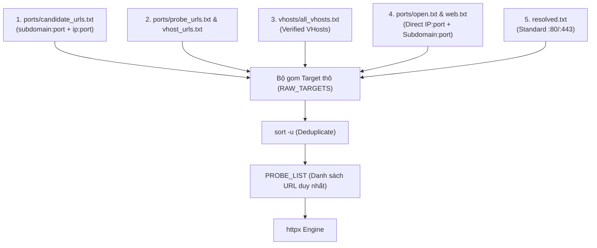
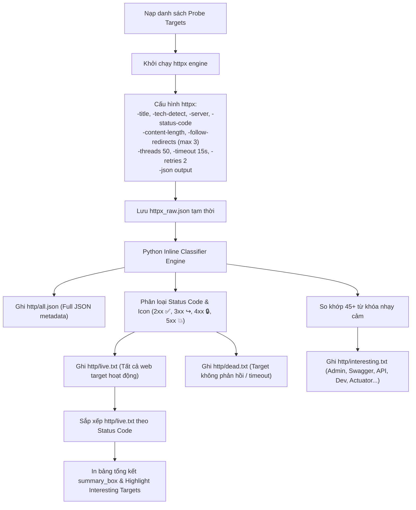
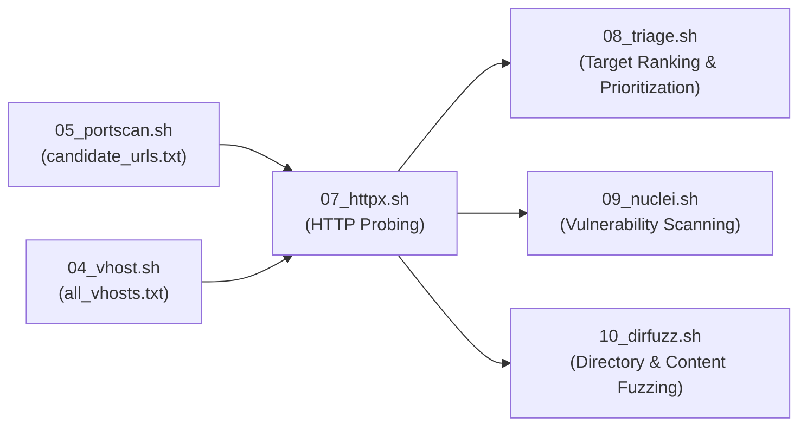

# 07_httpx.sh — HTTP Probing & Tech Stack Detection

> Tài liệu kỹ thuật mô tả cách sử dụng, kiến trúc input/output, cơ chế dò quét HTTP, nhận diện công nghệ (Tech Stack) và phân loại mục tiêu của script `scripts/07_httpx.sh`.

---

## 1. Tổng quan & Mục tiêu

`07_httpx.sh` là bước chuyển tiếp cốt lõi từ tầng quét mạng (Network & Port Scanning) sang tầng kiểm thử ứng dụng web (Web Application Pentest). Script sử dụng **`httpx`** (ProjectDiscovery) để gửi request HTTP/HTTPS đa luồng tốc độ cao, thu thập metadata của dịch vụ web và phân loại mục tiêu.

### Mục tiêu chính:
* **Xác thực trạng thái hoạt động (Liveness Check)**: Kiểm tra phản hồi thực tế của các URL ứng viên (Candidate URLs) trên cả cổng tiêu chuẩn (80, 443) lẫn non-standard ports (8080, 8443, 8000, 8888, 9000, v.v.).
* **Thu thập Web Metadata**: Bóc tách mã trạng thái HTTP (`Status Code`), tiêu đề trang (`HTML Title`), định danh máy chủ (`Server Header`), độ dài nội dung (`Content-Length`) và chuỗi chuyển hướng (`Redirect Location`).
* **Nhận diện công nghệ (Technology Fingerprinting)**: Tự động phát hiện Web Servers (Nginx, Apache, IIS), Frameworks (Spring Boot, Django, Laravel, React, Angular, Vue), CMS (WordPress, Drupal), và các hạ tầng điện toán đám mây.
* **Tự động lọc mục tiêu nhạy cảm (`interesting.txt`)**: Quét theo 45+ bộ nhận diện từ khóa (Admin, Login, API, Swagger, GraphQL, Dev/Staging, CI/CD, Dashboard, Spring Actuator, OAuth, SSO).
* **Chuẩn bị đầu vào cho các bước tiếp theo**: Cung cấp dữ liệu chuẩn hóa cho `08_triage.sh` (Phân hạng mục tiêu), `09_nuclei.sh` (Quét lỗ hổng tự động), và `10_dirfuzz.sh` (Fuzz thư mục ẩn).

---

## 2. Cách sử dụng

### 2.1. Chạy trong toàn bộ Recon Pipeline (Khuyến nghị)
```bash
# 1. Chạy toàn bộ pipeline từ bước 07 đến hết
./recon.sh example.com --from 07

# 2. Chỉ chạy duy nhất bước 07 (yêu cầu đã có kết quả từ bước 04 hoặc 05)
./recon.sh example.com --only 07
```

### 2.2. Chạy độc lập script
```bash
# Chạy trực tiếp script với domain chỉ định
./pipeline/scripts/07_httpx.sh example.com

# Xem hướng dẫn trợ giúp
./pipeline/scripts/07_httpx.sh --help
```

### 2.3. Yêu cầu công cụ
* **`httpx`**: Công cụ quét HTTP của ProjectDiscovery (`go install -v github.com/projectdiscovery/httpx/cmd/httpx@latest`).
* **`python3`**: Dùng để phân tích file JSON thô và phân loại kết quả.
* **`ulimit -n 65535`**: Script tự động tối ưu giới hạn file descriptor cho các kết nối socket đồng thời.

---

## 3. Kiến trúc Input (Merge & Deduplicate All Sources)

Script quét và **hợp nhất (Merge) toàn bộ tất cả các nguồn dữ liệu có sẵn**, sau đó tiến hành **loại bỏ trùng lặp (Deduplicate)** để đưa vào `httpx`:



| Nguồn Input | File vị trí | Xử lý khi nạp | Mục đích |
| :--- | :--- | :--- | :--- |
| `candidate_urls.txt` | `output/<domain>/ports/candidate_urls.txt` | Nạp nguyên bản URL | Chứa subdomain và IP kèm cổng mở từ bước `05_portscan.sh`. |
| `probe_urls.txt` | `output/<domain>/ports/probe_urls.txt` | Nạp nguyên bản URL | Danh sách URL ứng viên dự phòng từ bước quét cổng. |
| `vhost_urls.txt` | `output/<domain>/ports/vhost_urls.txt` | Nạp nguyên bản URL | Danh sách URL VHost tương thích ngược. |
| `all_vhosts.txt` | `output/<domain>/vhosts/all_vhosts.txt` | Ghép `http://` & `https://` | Danh sách VHost đã được xác thực từ bước `04_vhost.sh`. |
| `open.txt` & `web.txt`| `output/<domain>/ports/open.txt` | Sinh `ip:port` + map với `resolved.txt` | Toàn bộ các cổng mở trực tiếp trên IP và subdomain tương ứng. |
| `resolved.txt` | `output/<domain>/resolved.txt` | Ghép `http://` & `https://` | Toàn bộ subdomain sống trên cổng tiêu chuẩn (:80, :443). |

> [!NOTE]
> Khi chạy bước 07, script sẽ tự động kiểm tra sự tồn tại của từng file trên. File nào có dữ liệu sẽ được đọc và nạp vào danh sách tổng. Toàn bộ URL trùng lặp (giữa các bước hoặc giữa IP và Subdomain) sẽ được loại bỏ triệt để (`sort -u`), giúp tối ưu hóa thời gian quét và không gửi request thừa.

---

## 4. Cơ chế hoạt động chi tiết (Detailed Workflow)



### 4.1. Cấu hình & Tối ưu hóa `httpx`
Script gọi `httpx` với bộ tham số chuẩn hóa:
```bash
httpx \
    -l "$PROBE_LIST" \
    -title \
    -tech-detect \
    -server \
    -status-code \
    -content-length \
    -follow-redirects \
    -max-redirects 3 \
    -timeout 15 \
    -threads 50 \
    -retries 2 \
    -no-color \
    -json \
    -silent
```
* **Tự động theo dõi chuyển hướng (`-follow-redirects -max-redirects 3`)**: Hỗ trợ chuyển hướng từ HTTP sang HTTPS hoặc chuyển hướng sang cổng/đường dẫn xác thực nội bộ.
* **Đa luồng an toàn (`-threads 50 -timeout 15`)**: Tối ưu tốc độ quét đồng thời duy trì độ ổn định đường truyền mạng.

### 4.2. Python Classifier & Bộ từ khóa nhận diện mục tiêu nhạy cảm
Script Python nội tuyến phân tích từng dòng JSON và gắn nhãn các mục tiêu đặc biệt:

#### 1. Bảng quy chuẩn Icon trạng thái:
* `✅ [2xx]`: Thành công (OK, Accepted).
* `↪️ [3xx]`: Chuyển hướng (Moved Permanently, Found).
* `🔒 [4xx]`: Bị chặn / Cần xác thực / Không tìm thấy (Unauthorized, Forbidden, Not Found).
* `💥 [5xx]`: Lỗi máy chủ nội bộ (Internal Server Error, Bad Gateway).

#### 2. Bộ từ khóa phân loại `interesting.txt`:
Mọi URL, HTML Title, Server Header hoặc danh sách Technologies chứa một trong các từ khóa sau sẽ được tự động đưa vào `http/interesting.txt`:
* **Quản trị & Đăng nhập**: `admin`, `login`, `panel`, `portal`, `dashboard`, `manage`, `manager`, `management`.
* **API & Tài liệu**: `api`, `swagger`, `graphql`, `rest`, `v1`, `v2`, `v3`.
* **Môi trường nội bộ & Thử nghiệm**: `dev`, `staging`, `test`, `qa`, `beta`, `preview`, `uat`, `sandbox`.
* **CI/CD & Source Control**: `git`, `jenkins`, `gitlab`, `github`, `ci`, `cd`, `build`, `deploy`.
* **Hạ tầng & Giám sát**: `kibana`, `grafana`, `prometheus`, `sonarqube`, `rancher`, `k8s`.
* **Database Management**: `phpmyadmin`, `adminer`, `dbadmin`.
* **Quản lý dự án**: `jira`, `confluence`, `bitbucket`, `trello`.
* **Tiện ích nhạy cảm**: `upload`, `backup`, `console`, `shell`, `terminal`, `intranet`, `internal`, `corp`, `vpn`.
* **Xác thực & Danh tính**: `oauth`, `sso`, `auth`, `token`, `jwt`, `saml`.
* **Debug & Metrics**: `actuator`, `metrics`, `health`, `debug`, `trace`.

---

## 5. Cấu trúc Output

Toàn bộ kết quả được lưu trữ tại `output/<domain>/http/` (hoặc `recon_output/<domain>/http/`):

| File Output | Định dạng | Mục đích sử dụng |
| :--- | :--- | :--- |
| `live.txt` | Text (Sắp xếp theo status) | Danh sách tất cả các web endpoint phản hồi hợp lệ kèm Title, Server banner, Tech stack và Content-Length. |
| `dead.txt` | Text | Danh sách các URL không phản hồi hoặc timeout khi probe. |
| `interesting.txt` | Text kèm tag `[kw:<keyword>]` | Danh sách mục tiêu nhạy cảm có giá trị khai thác cao nhất cần ưu tiên pentest. |
| `all.json` | JSON Lines (`.jsonl`) | Toàn bộ dữ liệu JSON thô đầy đủ từ httpx phục vụ parsing và tích hợp tự động. |
| `../logs/07_httpx.log` | Log text | Nhật ký thực thi chi tiết của bước quét. |

### Mẫu dòng kết quả trong `live.txt`:
```text
✅ [200] https://mbbank.com.vn  | MBBank - Ngân hàng TMCP Quân đội  | cloudflare  | [Cloudflare, React, Next.js]  (45231b)
↪️ [301] http://mbbank.com.vn  | 301 Moved Permanently  | cloudflare  (167b)
🔒 [403] https://api-internal.mbbank.com.vn  | 403 Forbidden  | nginx  (548b)
✅ [200] https://swagger.mbbank.com.vn/api-docs  | Swagger UI  | [Swagger, Spring Boot]  (12431b)
```

---

## 6. Luồng tích hợp trong Pipeline



* **`08_triage.sh`**: Sử dụng `live.txt`, `interesting.txt` và `all.json` để chia hạng các mục tiêu thành **Tier 1 (High Value)**, **Tier 2 (Standard)**, và **Tier 3 (Edge/CDN)**.
* **`09_nuclei.sh`**: Nạp trực tiếp danh sách live target để quét các lỗ hổng bảo mật đã biết (CVEs, misconfigurations, default credentials).
* **`10_dirfuzz.sh`**: Lấy danh sách URL hoạt động từ `live.txt` làm input mặc định để thực hiện dò quét đường dẫn và tệp tin ẩn.
