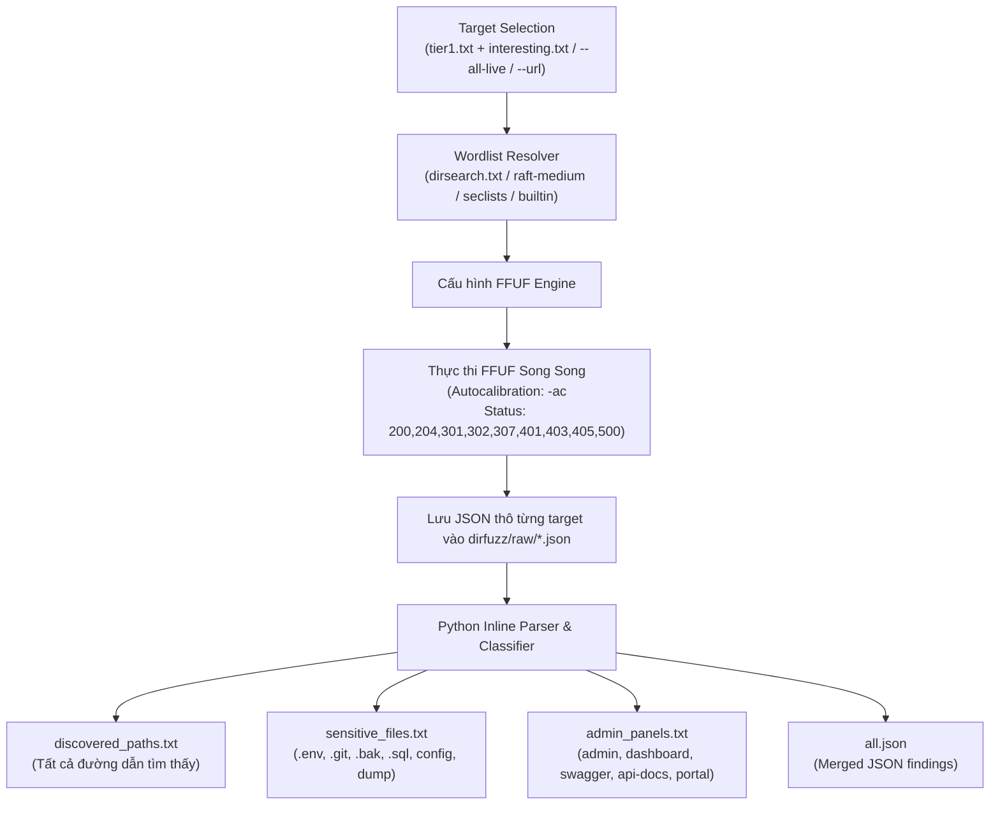

# 10_dirfuzz.sh — Tài liệu kỹ thuật

> Tài liệu này mô tả chi tiết cách sử dụng, kiến trúc hoạt động, bộ từ điển, cơ chế chống false positive và định dạng kết quả của `scripts/10_dirfuzz.sh`.

---

## 1. Tổng quan & Mục tiêu

`10_dirfuzz.sh` sử dụng công cụ **`ffuf`** (Fuzz Faster U Fool) để thực hiện quét thư mục và nội dung ẩn (Directory & Content Discovery) trên các mục tiêu web.

### Mục tiêu phát hiện:
* **Tệp tin cấu hình & mã nguồn nhạy cảm**: `.env`, `.git/config`, `web.config`, `.htaccess`, `config.json`, `config.php`, `config.yml`.
* **Bản sao lưu & Database Dump**: `.bak`, `.old`, `.zip`, `.tar.gz`, `dump.sql`, `backup.sql`.
* **Trang quản trị & Bảng điều khiển**: `/admin`, `/login`, `/dashboard`, `/portal`, `/console`, `/phpmyadmin`, `/kibana`.
* **API Documentation & Endpoints**: `/swagger-ui.html`, `/swagger.json`, `/openapi.json`, `/graphql`, `/graphiql`, `/actuator/health`, `/actuator/env`.

---

## 2. Cách sử dụng

```bash
# 1. Chạy qua Master Pipeline Controller
./recon.sh example.com --only 10

# 2. Chạy độc lập với cấu hình mặc định (Quét các target Tier 1 & Interesting)
./scripts/10_dirfuzz.sh example.com

# 3. Quét toàn bộ HTTP targets còn sống (http/live.txt)
./scripts/10_dirfuzz.sh example.com --all-live

# 4. Quét duy nhất một URL chỉ định
./scripts/10_dirfuzz.sh example.com --url https://api.example.com

# 5. Tùy chỉnh danh sách phần mở rộng (Extensions)
./scripts/10_dirfuzz.sh example.com --ext php,json,env,bak,sql

# 6. Tối ưu hiệu năng & Rate limit (tránh bị WAF/Rate limit chặn)
./scripts/10_dirfuzz.sh example.com --rate 50 --threads 20 --concurrency 2

# 7. Quét đệ quy thư mục (Recursion)
./scripts/10_dirfuzz.sh example.com --recursion --recursion-depth 2
```

### Bảng tham số (CLI Flags)

| Tham số | Giá trị mặc định | Mô tả |
| :--- | :--- | :--- |
| `--all-live` | `off` | Quét toàn bộ danh sách `http/live.txt` thay vì chỉ quét Tier 1 & Interesting. |
| `--url <URL>` | `""` | Quét duy nhất 1 URL cụ thể. |
| `--targets <file>` | `""` | Chỉ định file danh sách target URL tùy chỉnh. |
| `-w, --wordlist <file>` | `dirsearch.txt` | Chỉ định đường dẫn wordlist tùy chỉnh. |
| `-e, --ext <list>` | Server-side + PHP variants + Archives + DB + Configs | Danh sách phần mở rộng nối vào wordlist (Mặc định: `php,php3..php8,phtml,phar,inc,jsp,jspx,action,do,class,jar,war,asp,aspx,ashx,asmx,axd,svc,py,rb,pl,cgi,cfm,zip,tar,tar.gz,tgz,rar,7z,gz,bz2,bak,backup,old,save,swp,tmp,sql,dump,db,env,config,conf,cfg,ini,json,xml,yaml,properties,txt,log`). |
| `--no-ext` | `off` | Tắt tự động thêm extensions (chỉ fuzz theo đúng từ trong wordlist). |
| `-t, --threads <N>` | `40` | Số luồng worker song song cho mỗi target. |
| `-r, --rate <N>` | `150` | Giới hạn request/giây tối đa trên mỗi target. |
| `--concurrency <N>` | `3` | Số lượng target web được fuzz đồng thời. |
| `--recursion` | `off` | Bật tự động quét sâu vào các thư mục con tìm thấy. |
| `--recursion-depth <N>`| `1` | Độ sâu đệ quy tối đa. |
| `-h, --help` | `off` | Hiển thị hướng dẫn sử dụng. |

---

## 3. Quy trình hoạt động (Dataflow & Execution)



### Các tầng xử lý chính:

1. **Lựa chọn mục tiêu (Target Prioritization)**:
   - Thay vì quét toàn bộ hàng trăm subdomain làm nghẽn mạng và tốn thời gian, script mặc định ưu tiên quét các mục tiêu có giá trị cao nhất từ `triage/tier1.txt` và `http/interesting.txt`.
2. **Cơ chế chống False Positive (Autocalibration `-ac`)**:
   - `ffuf` gửi các request thăm dò ngẫu nhiên để xác định phản hồi Soft 404, WAF catch-all và SPA routing của máy chủ, sau đó tự động lọc bỏ các phản hồi giả mạo mà không cần lọc mã lỗi 404 thủ công.
3. **Phân loại tự động (Classification Engine)**:
   - Script Python tự động quét qua toàn bộ JSON kết quả thô, bóc tách và phân loại các phát hiện vào các file kết quả chuyên biệt để phục vụ kiểm thử thủ công và viết báo cáo.

---

## 4. Cấu trúc Output

Tất cả kết quả được lưu trữ tại `output/<domain>/dirfuzz/` (hoặc `recon_output/<domain>/dirfuzz/`):

| File Output | Định dạng | Ý nghĩa & Mục đích sử dụng |
| :--- | :--- | :--- |
| `discovered_paths.txt` | Text `[STATUS] [SIZE] [WORDS] URL` | Bảng tổng hợp toàn bộ các đường dẫn và endpoint phát hiện được. |
| `sensitive_files.txt` | Text `[STATUS] [SIZE] [WORDS] URL` | Các tệp tin cấu hình, backup, dump cơ sở dữ liệu, secret keys. |
| `admin_panels.txt` | Text `[STATUS] [SIZE] [WORDS] URL` | Các trang quản trị, dashboard, cổng đăng nhập, swagger docs. |
| `all.json` | JSON format | Toàn bộ kết quả chi tiết kèm metadata để tích hợp và báo cáo. |
| `raw/<target>.json` | JSON format | Kết quả chi tiết của từng target riêng lẻ. |

---

## 5. Mẫu kết quả đầu ra

### Mẫu `dirfuzz/sensitive_files.txt`
```text
[200] [size: 428] [words: 32] https://api.example.com/.env
[200] [size: 1520] [words: 89] https://dev.example.com/config.json
[200] [size: 450201] [words: 12054] https://internal.example.com/backup.zip
[301] [size: 178] [words: 10] https://portal.example.com/.git -> https://portal.example.com/.git/
```

### Mẫu `dirfuzz/admin_panels.txt`
```text
[200] [size: 2840] [words: 154] https://online.example.com/admin/login
[200] [size: 512] [words: 45] https://api.example.com/swagger-ui.html
[200] [size: 12044] [words: 802] https://api.example.com/v2/api-docs
[401] [size: 320] [words: 18] https://kibana.example.com/login
```
